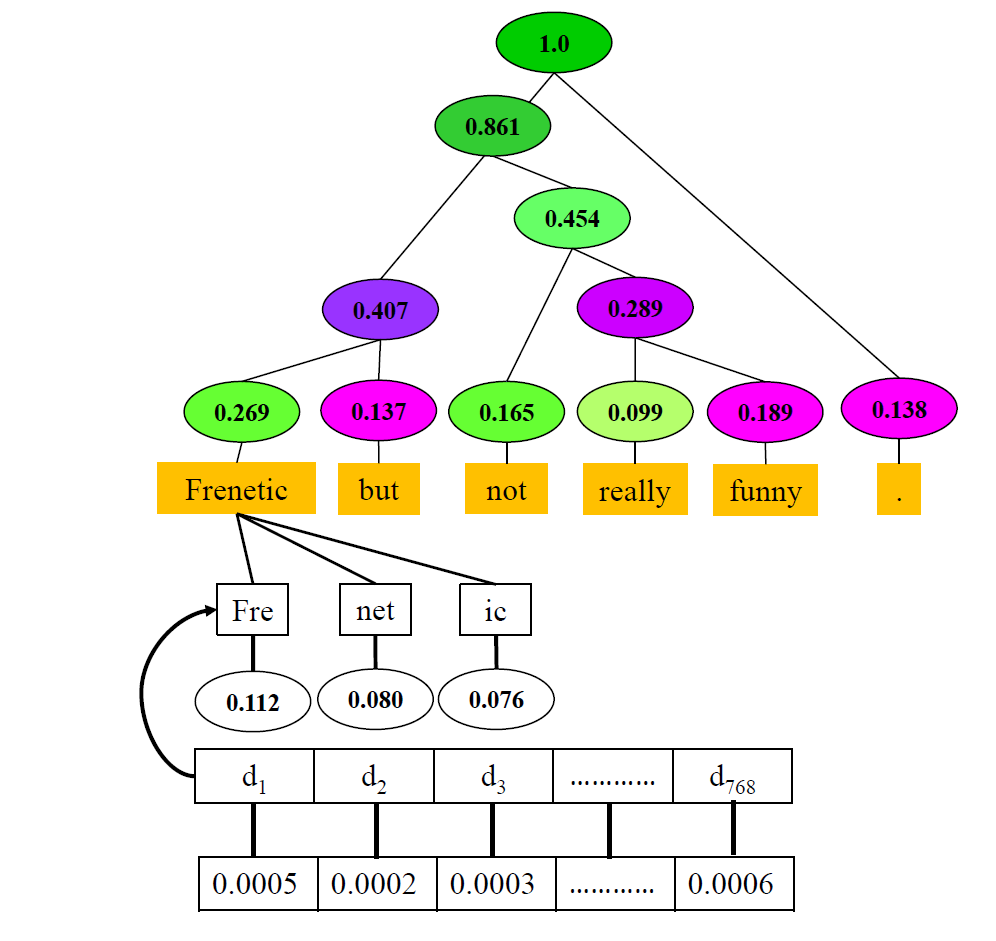

# integrated-directional-gradients
Implementation of the Integrated Directional Gradients method for Deep Nerual Network model explanations.

> Integrated Directional Gradients: Feature Interaction Attribution for Neural NLP Models. Sandipan Sikdar, Parantapa Bhattacharya, and Kieran Heese accepted at ACL'21 

***Please cite our paper in any published work that uses any of these resources.***

~~~
@inproceedings{sikdar-etal-2021-integrated,
    title = "Integrated Directional Gradients: Feature Interaction Attribution for Neural {NLP} Models",
    author = "Sikdar, Sandipan  and
      Bhattacharya, Parantapa  and
      Heese, Kieran",
    booktitle = "Proceedings of the 59th Annual Meeting of the Association for Computational Linguistics and the 11th International Joint Conference on Natural Language Processing (Volume 1: Long Papers)",
    month = aug,
    year = "2021",
    address = "Online",
    publisher = "Association for Computational Linguistics",
    url = "https://aclanthology.org/2021.acl-long.71",
    pages = "865--878",
}
~~~

## Abstract

In this paper, we introduce Integrated Directional Gradients (IDG), a method for attributing importance scores to groups of features, indicating their relevance to the output of a neural network model for a given input. The success of Deep Neural Networks has been attributed to their ability to capture higher level feature interactions. Hence, in the last few years capturing the importance of these feature interactions has received increased prominence in ML interpretability literature. In this paper, we formally define the feature group attribution problem and outline a set of axioms that any intuitive feature group attribution method should satisfy. Earlier, cooperative game theory inspired axiomatic methods only borrowed axioms from solution concepts (such as Shapley value) for individual feature attributions and introduced their own extensions to model interactions. In contrast, our formulation is inspired by axioms satisfied by characteristic functions as well as solution concepts in cooperative game theory literature. We believe that characteristic functions are much better suited to model importance of groups compared to just solution concepts. We demonstrate that our proposed method, IDG, satisfies all the axioms. Using IDG we analyze two state-of-the-art text classifiers on three benchmark datasets for sentiment analysis. Our experiments show that IDG is able to effectively capture semantic interactions in linguistic models via negations and conjunctions.

Computation of attribution score (value function
v) for an example sentence Frenetic but not
really funny. Magenta and green respectively denote
negative or positive contribution to the inferred
class and the importance is represented by the color intensity.
Constituency parse tree is used to obtain meaningful
feature groups. Note that each word is further divided
into tokens (owing to byte pair encodings) each
of which has 768 dimensions. IDG computes importance
scores in a bottom-up manner starting from the
individual embedding dimensions working its way
up to tokens, words, phrases and finally the sentence
## Requirements
  
captum==0.2.0

numpy==1.19.0

sentencepiece==0.1.91

torch==1.5.1

tqdm==4.46.1

transformers==3.0.2

graphviz==2.47.1

nltk==3.5

## Running the code

python main.py -n [model name] -mp [model path] -i [input file] -cls [ground truth class] -o [output path]

model name - 'xlnet' or 'bert' (these two models have been implemented as of now)

model path - path to the pre-trained classifier model

input file - the parse tree of the text for which you want to compute the scores. In case your text has multiple sentences compute parse trees for each sentence separately and add them to input file, one tree per line (check out the tree format in input.txt). For SST dataset, the input texts are already available in parse tree format. For the others we used the parsing model by Mrini et. al. (https://github.com/KhalilMrini/LAL-Parser).

ground truth class - e.g., 0/1 for a binary classifier. The scores are however computed based on the inferred class.

output path - The image is stored in this path (default is the same folder)

The code is commented for ease of use

To precisely visualize the interactions between phrases, we search over the test examples for instances
of negations. The examples that we picked for the three datasets can be found in the 'Examples' folder.
